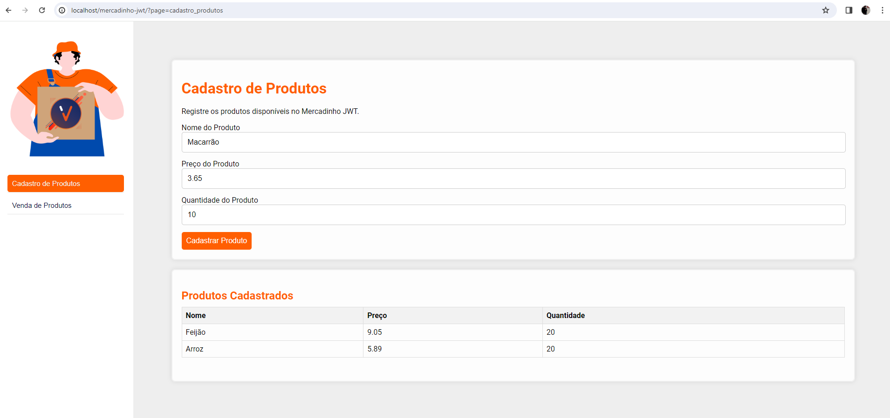
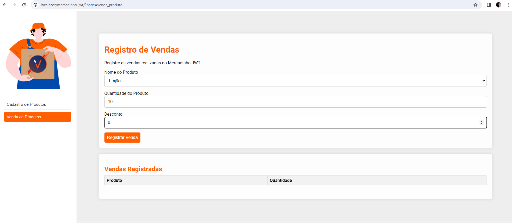
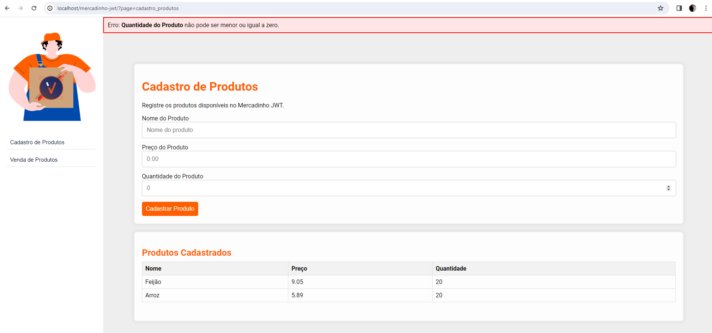
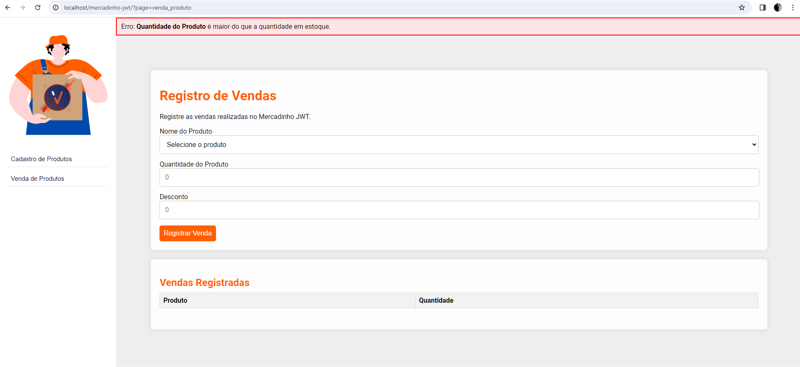
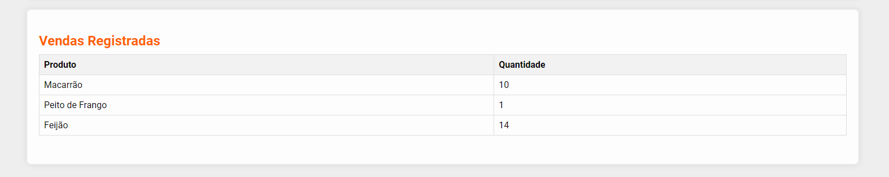

# Desafio técnico: Desenvolvedor de Software 🚀

Desenvolver um sistema de Ponto de Venda (PDV)

## Estrutura do Projeto:

- A lógica central está nas classes Produto e Venda, seguindo os princípios da Programação Orientada a Objetos (POO).
- Utilizei exceções (QuantidadeInvalidaException, PrecoInvalidoException e QuantidadeInsuficienteException) para tratar erros relacionados a quantidade e preço de produtos e estoque.
- A classe BancoDadosMemoria simula um banco de dados em memória para armazenar produtos e vendas.
- Utilizei o padrão MVC para uma melhor arquitetura do projeto.

## Produtos

## Vendas

## Como Executar:

- Clone o repositório: git clone https://github.com/wladi-silva/mercadinho-jwt.git
- Abra o projeto em um servidor PHP (por exemplo, XAMPP ou Apache).
- Acesse a página principal: http://localhost/mercadinho-jwt

## Tratamento de Erros

## Funcionalidades Implementadas:
- <h3>Cadastro de Produtos:</h3>

- <h3>Listagem de Produtos:</h3>

- <h3>Venda de Produtos:</h3>

- <h3>Listagem de Vendas:</h3>

## Extra
- Com a utilização do Banco em Memória, ao vender um produto, ele é automaticamente descontado da tela de produtos.
